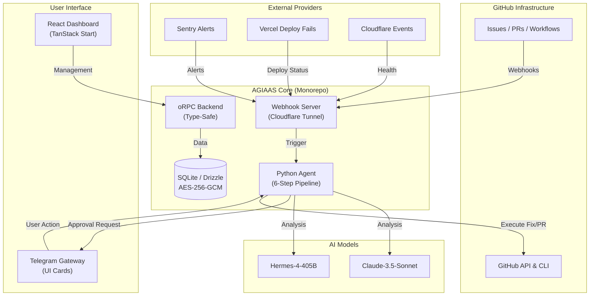
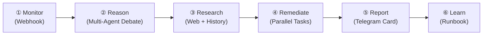

# Architecture

AGIAAS is built as a modular monorepo, with its primary intelligence powered by the [Hermes Agent](https://hermes-agent.nousresearch.com/docs/) core.

## High-Level Flow

The following diagram illustrates how events from GitHub and external providers flow through the AGIAAS infrastructure, triggering the autonomous agent pipeline.

## The 6-Step Agent Pipeline

When triggered by any webhook event, the agent follows this autonomous pipeline:

| Step | Component | Description |
| :--- | :--- | :--- |
| **Monitor** | `webhook-server` | Receives events from GitHub, Sentry, Vercel, Cloudflare via Cloudflare tunnel |
| **Reason** | `mixture_of_agents_debate()` | Multi-agent reasoning with Claude / Hermes for root-cause analysis |
| **Research** | `web_research()` + `session_research()` | Combines web search with historical session data |
| **Remediate** | `parallel_remediation()` | Executes fix tasks in parallel (patch, restart, cache clear) |
| **Report** | `send_telegram_message()` | Sends structured UI Card with diff, cost, and approval buttons |
| **Learn** | `generate_runbook()` | Creates a structured runbook for future incident prevention |

## Layer Breakdown

### 📡 Monitoring Layer (`@agiaas/webhook-server`)
The gateway for all external events. Uses **Cloudflare Tunnels** (auto-provisioned) to receive webhooks and automatically syncs GitHub webhook URLs when the tunnel restarts.

**Supported providers:**
- GitHub (Issues, PRs, Workflow runs, Pushes)
- Sentry (New issue alerts)
- Vercel (Deployment status)
- Cloudflare (Pages deployment health)

### 🧠 Agent Layer (`@agiaas/agent`)
The core intelligence layer. A specialized implementation of the [Hermes Agent](https://hermes-agent.nousresearch.com/docs/) that uses **LLMs** to:
1. Parse error logs and issue descriptions using reasoning skills
2. Search the codebase for relevant files via filesystem tools
3. Propose and test code patches autonomously
4. Generate runbooks after incident resolution

### 💼 Management Layer (`@agiaas/web` & `@agiaas/api`)
The administrative hub for managing your agent instances.
- **API**: Type-safe **oRPC** backend with Hono
- **Dashboard**: TanStack Start application for monitoring agent performance, costs, and the incident timeline

### 📱 Messaging Gateway (Telegram)
Provides a secure, mobile-friendly interface for engineers to approve or reject agent actions with structured **UI Cards** that include:
- Incident context and root-cause summary
- Proposed code diff
- Real-time cost tracking (tokens + USD)
- One-tap action buttons (✅ Approve / ❌ Reject / 💬 Re-Analyze)

### 🔐 Security Layer (`@agiaas/db` + `@agiaas/auth`)
- **AES-256-GCM encryption** for all stored secrets (GitHub tokens, webhook secrets)
- **better-auth** session-based authentication for the dashboard
- **Zod-validated environment** variables via `@t3-oss/env-core`

## Technology Stack

| Layer | Technology |
| :--- | :--- |
| **AI Models** | Claude-3.5-Sonnet, Hermes-4-405B (via OpenRouter / Nous Research) |
| **Agent Engine** | Custom Python agent with Mixture-of-Agents reasoning |
| **Frontend** | TanStack Start + Tailwind CSS + Radix UI + WebGL (ASCIIText) |
| **Backend API** | oRPC (end-to-end type safety) + Hono |
| **Database** | SQLite + Drizzle ORM + AES-256-GCM encrypted secrets |
| **Authentication** | better-auth (session-based) |
| **Messaging** | python-telegram-bot (structured UI Cards) |
| **Infrastructure** | Docker Compose, Cloudflare Tunnels (auto-provisioned) |
| **Monorepo** | Turborepo + pnpm workspaces |
| **Code Quality** | Biome (lint + format) + TypeScript strict mode |
